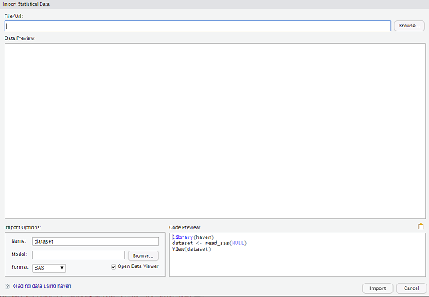

<style type="text/css">

slides > slide:before {
  font-size: 12pt;
  content: 'http://shiny.rstudio.com/';
  position: absolute;
  text-align: center;
  bottom: 15px;
  left: 50%;  
  margin-left: -300px;
  width: 600px;
  line-height: 1.9;
}

div.img-col{
  text-align: center;
  font-size: 14pt;
}

a {
  border-bottom: none !important;
}

.wrapper {
  margin: 70px auto;
  position: relative;
  z-index: 90;
}

.ribbon-wrapper-green {
  width: 145px;
  height: 148px;
  overflow: hidden;
  position: absolute;
  top: -3px;
  right: -3px;
}

.ribbon-green {
  font: bold 15px Sans-Serif;
  color: #333;
  text-align: center;
  text-shadow: rgba(255,255,255,0.5) 0px 1px 0px;
  -webkit-transform: rotate(45deg);
  -moz-transform:    rotate(45deg);
  -ms-transform:     rotate(45deg);
  -o-transform:      rotate(45deg);
  position: relative;
  padding: 7px 0;
  left: -25px;
  top: 45px;
  width: 220px;
  background-color: #7ADCBF;
  background-image: -webkit-gradient(linear, left top, left bottom, from(#8AACDF), to(#658FBE)); 
  background-image: -webkit-linear-gradient(top, #8AACDF, #658FBE); 
  background-image:    -moz-linear-gradient(top, #8AACDF, #658FBE); 
  background-image:     -ms-linear-gradient(top, #8AACDF, #658FBE); 
  background-image:      -o-linear-gradient(top, #8AACDF, #658FBE); 
  color: #6a6340;
  -webkit-box-shadow: 0px 0px 3px rgba(0,0,0,0.3);
  -moz-box-shadow:    0px 0px 3px rgba(0,0,0,0.3);
  box-shadow:         0px 0px 3px rgba(0,0,0,0.3);
}

.ribbon-green:before, .ribbon-green:after {
  content: "";
  border-top:   3px solid #00896e;   
  border-left:  3px solid transparent;
  border-right: 3px solid transparent;
  position:absolute;
  bottom: -3px;
}

.ribbon-green:before {
  left: 0;
}
.ribbon-green:after {
  right: 0;
}
</style>

# Setup

## Info

- R
- Packages
- IDE
- Projects
- Sessions
- Git/Github
- RSC
- Shiny

## IDE PICK A DATASET

- Built-in datasets
- data()
- data(ToothGrowth)
- ?ToothGrowth
- ToothGrowth
- View(ToothGrowth)
- summary(ToothGrowth)
- plot(ToothGrowth)

## R for Data Science
- [http://r4ds.had.co.nz/](http://r4ds.had.co.nz/)
- [tidyverse](https://blog.rstudio.org/2016/09/15/tidyverse-1-0-0/)
- https://github.com/rstudio/RStartHere

## IDE LET’S EXPLORE...
- getwd()
- library(tidyverse)
- let us explore the data set a bit
- names(ToothGrowth) # names of the variables
- dim(ToothGrowth) # dimension (number of rows and columns)
- str(ToothGrowth) # structure of the data set
- class(ToothGrowth)
- head(ToothGrowth, n = 5)
- tail(ToothGrowth, n = 5)
- ToothGrowth%>% write_csv('ToothGrowth.csv')
- ToothGrowth2 <-read_csv("ToothGrowth.csv")

## DATATYPES
- R has a wide variety of data types…
- Vectors
- Lists
- Matrix
- Factors
- Data frame
- Tibble

## Creating a Tibble DF

```{r}
library(tibble)
storms <-tribble(
~storm, ~wind, ~pressure, ~date,
"Alberto", 110, 1007, "2000-08-12",
"Alex", 45, 1009, "1998-07-30",
"Allison", 65, 1005, "1995-06-04",
"Ana", 40, 1013, "1997-07-01",
"Arlene", 50, 1010, "1999-06-13",
"Arthur", 45, 1010, "1996-06-21"
)

```

## Tibbles

- http://colorado.rstudio.com/rsc/content/678/tidyverse_notebook.nb.html

```{r}
trilogies <- c(
  "Prequels: Episode I-III", 
  "Originals: Episode IV-VI", 
  "Sequels: Episode VII"
  )
```

## Preview - Importing Data
<div class="columns-2">

- Tabular
- Hierarchical
- Relational
- Distributed
 
  <div class="img-col">
   
   
 </div>
</div>

## Tabular
- 01-tabular-data.R

## Import Dataset Menu

<div class="columns-2">
- RStudio Connections Pane
- Easy to use
- Writes code

<div class="img-col">

   
 </div>
</div>

## Hierarchical Data
- tree-like structure
- XML, JSON, HTML, etc.
- 02-hierarchical-data.R

# Databases SQL

## RODBC RJDBC Some info

- https://rpubs.com/newajay/RODBCanalysis
- http://rpubs.com/douglaserice/importing
- https://www.progress.com/blogs/complete-guide-to-r-for-datadirect-odbc-jdbc
- https://www.r-bloggers.com/connecting-r-to-an-oracle-database-with-rjdbc/
- https://www.ibm.com/developerworks/data/library/techarticle/dm-1402db2andr/
- https://www.linkedin.com/pulse/connect-oracle-database-r-rjdbc-tianwei-zhang/

## Importing Relational Data
- Relationships between data
- tuples
- Drivers

## Databases - Connect R to	yourdata

- Explore your databases using the RStudio IDE
- Develop and deploy Shiny applications	that connect on databases
- Learn best practices for using R with	your databases
- Connection	Wizard
- Connections	Tab
- https://blog.rstudio.com/2017/08/16/rstudio-preview-connections/

## Landscape

- DBI
- dplyr
- dbplyr [New!]
- odbc [New!]
- http://db.rstudio.com/

## DB - Three	ways to write	queries
- DBI	code
- dplyr syntax
- R	Notebook	SQL	language	engine
- https://rviews.rstudio.com/2017/10/18/database-queries-with-r/

## The Force is Strong with dplyr
- http://db.rstudio.com/dplyr/
- https://cran.r-project.org/web/packages/dbplyr/vignettes/sql-translation.html
- http://www.datacarpentry.org/R-ecology-lesson/05-r-and-databases.html#sql_translation

## DB Examples
- 03-relational-data.R
- quick_db_demo.Rmd
- https://rviews.rstudio.com/2017/10/18/database-queries-with-r/
- https://community.rstudio.com/t/why-does-rstudio-documentation-recommend-odbc-vs-jdbc-drivers/2381/5
- http://redpillanalytics.com/how-to-use-the-new-r-odbc-package-to-connect-to-an-oracle-database/

## Drivers
- ODBC data connectors
- https://www.rstudio.com/products/drivers/

## Shiny

- Pool
- http://db.rstudio.com/pool/

## Distributed Sources
- CSV goes to memory but... as data groww, intro Relational Model...
- Big Data - doesn't fit into a single, few machines
- 100, 1000s of nodes (computers)
- Spark
- HDFS
- Or Sampling

## Hadoop...It is often common to put RStudio Server on the edge nodes.

- http://spark.rstudio.com/guides/data-lakes/
- http://spark.rstudio.com/examples/cloudera-aws/
- http://spark.rstudio.com/examples/yarn-cluster-emr/
- http://spark.rstudio.com/examples/stand-alone-aws/
- http://db.rstudio.com/databases/hive/
- http://db.rstudio.com/databases/impala/
- http://db.rstudio.com/rstudio/connections